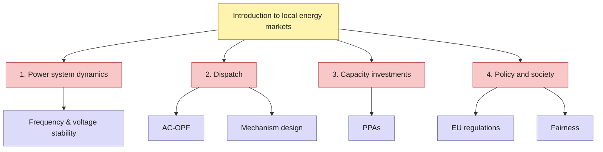

Local energy markets are studied by control engineers, optimizers, power engineers, economists and policy researchers, often in silos. This bi-weekly online seminar series brings these communities together around **one problem**, with every talk recorded so newcomers can learn about the parts outside their own field.

## Tree of knowledge

Each seminar fills in a node of this tree. It grows as the series goes on.

## Lectures



  <h3 class="mb-1">{{ lecture.title }}</h3>
  
<small>{{ lecture.date }} &middot; {{ lecture.track }}</small>

  
{{ lecture.description }}

  
    <a href="{{ lecture.video }}" target="_blank" rel="noopener"><i class="fa-solid fa-play"></i> Watch video</a>
  
    <small>Video coming soon</small>
  


